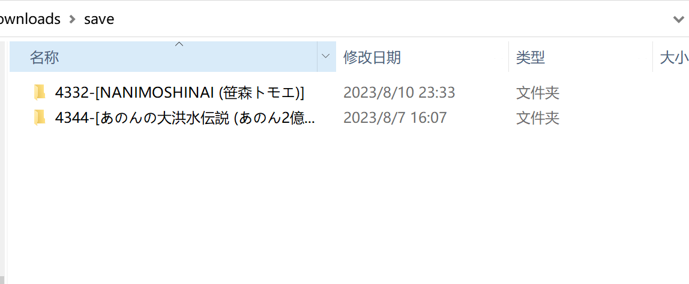
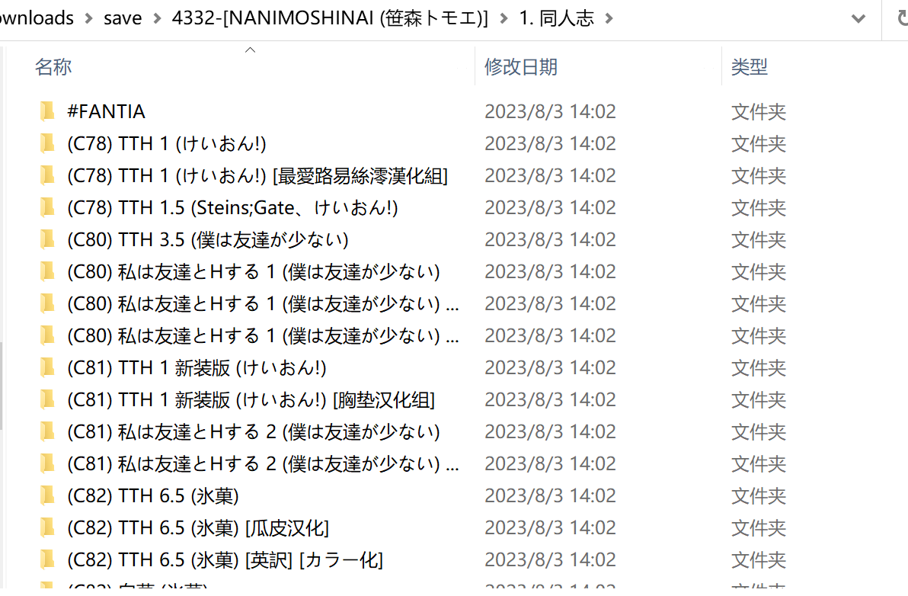

# GHS-Scripts

## 前言

这里是个人写的一些资源整理小工具。最终目的是实现资源的自动化下载-整理-处理。目前可以稍微实现一部分步骤的自动化，提升整理效率。对于同人志，我们希望能把资源转变为Lanraragi可以自动识别的格式（主要是文件名），这样可以方便导入。对于条漫，个人一般习惯使用pdf连续滚动翻页，因此希望能将网上下载的图片格式合成一个pdf。同时这里也介绍了一些其他常用工具。

## 目录
1. 下载辅助
   1. [百度云下载链接整合](sharelink_merge.py)
   2. [百度云批量转存：Pandownload](https://pandownload.net/)
2. 文件结构整理
   1. [批量重命名/移动：Everything](https://www.voidtools.com/zh-cn/downloads/)
   2. [本子合集自动整理](ibm_solve.py)
3. 后处理
   1. [图片纵向分割](split_png.py)
   2. [图片-PDF无损互转，图片压缩](pdf.py)
4. 存储与阅读
   1. [本子阅读：Lanraragi](https://github.com/Difegue/LANraragi)

## 使用说明
### 个人流程概述
1. 使用Pandownload批量转存百度云链接
   1. 如果是很多个txt文件，里面有百度云的分享链接和提取码，那么把他们放到同一个文件夹下，然后使用`sharelink_merge.py`合并成一个txt文件
   2. 使用Pandownload的批量转存功能，下载到本地
2. 下载下来的文件可能使用了各种混淆拓展名，此时推荐使用[Everything](https://www.voidtools.com/zh-cn/downloads/)把后缀名统一为`.zip`，然后使用[WinRAR](https://www.win-rar.com/download.html)解压
   1. [WinRAR](https://www.win-rar.com/download.html)可以存储密码。在解压有密码的文件的时候，可以在输入密码的对话窗口，点击`管理密码`，然后勾选`添加`，这样下次就可以只输前面的几个字母就可以自动填充密码了
3. 针对南+的ibm大佬的画师合集资源，可以使用[这个工具](ibm_solve.py)来自动整理文件。使用方法见下面的说明。
4. 如果是长图片，不方便使用的话，可以使用[这个工具](split_png.py)来切成短图片。
5. 对于条漫，如果图片是一张张的图片，可以使用[这个工具](pdf.py)来无损转换成pdf。同样的，如果是纯图片组成的pdf，也可以无损转换成图片。
6. 为了节省存储空间，也可以使用[这个工具](pdf.py)来压缩图片。具体的压缩比例可以自己调整。

### 本子合集自动整理
#### 输入
- 解压好的文件夹，满足以下文件结构：
  - 根目录：
  - 第一层子文件夹：
  - 第二层子文件夹：

#### 筛选规则
- 原资源可能对一个本子有不同版本，我们按以下规则进行筛选：
  1. 如果漫画有中文版本，则选择中文版本。
  2. 如果漫画有多个中文版本，则选择名称中带有“無修正”的版本。
  3. 如果漫画有多个带有“無修正”名称的中文版本，则选择页面最多的版本。
  4. 如果所有中文版本的页数都相同，则选择第一个版本。
  5. 如果漫画没有中文版本，则选择日语版本。
- 同时，以下文件夹也会被跳过：
  - 以"#"开头的文件夹
  - 名字里有“作品集”的文件夹
  - 有“別スキャン”字样的文件夹

#### 输出
- 每个本子分别压缩，文件名重新命名，命名规则是：(Event) [Author] ComicName (Series) [Translator] [Note]
- 输出结果：

#### 使用方法
1. 直接双击运行`comic_solve.exe`
2. Please input the root path: 输入包括单个/多个画师子文件夹的根目录。比如到第二层子文件夹的路径是：`C:\Users\Name\Downloads\save\4332-[NANIMOSHINAI (笹森トモエ)]\1. 同人志`，那么就输入`C:\Users\Name\Downloads\save`。
3. Please input the save path: 整理后结果的文件夹。可以和上面相同，也可以不同。

#### 效果
- 导入Lanraragi之后，文件名可以被正确解析
- 